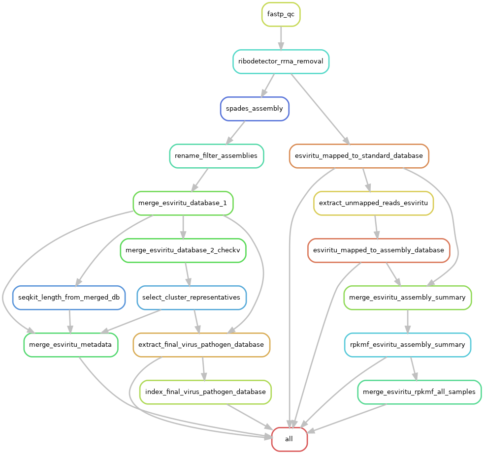

# Yangtze River RNA Virus Pipeline (Snakemake)

RNA virus bioinformatics workflow for paired-end RNA-seq data. The pipeline is defined in `Snakefile` and configured by `config/config_server/config_read.yaml`.

This README is intentionally detailed so you can reproduce the full run, understand each stage, and locate key outputs.

## Quick Start

1. **Prepare inputs** (paired-end reads):
   ```
   RNA_rawdata/{sample}/{sample}.R1.fq.gz
   RNA_rawdata/{sample}/{sample}.R2.fq.gz
   ```

2. **Edit config** in `config/config_server/config_read.yaml`:
   - `samples`: list of sample IDs (must match folder/file names)
   - `databases`: EsViritu database locations
   - `scripts`: paths to EsViritu/CheckV helper scripts
   - resource settings: `regular_memory`, `runtime`, `regular_partition`, `slurm_account`
   - optional: `correlation` section (threads, thresholds, p-value, etc.)

3. **Dry run**:
   ```
   snakemake -s Snakefile -n
   ```

4. **Run**:
   ```
   snakemake -s Snakefile --use-conda --cores 24
   ```

5. **Run a specific target** (example):
   ```
   snakemake -s Snakefile results/6_esviritu/es/second_filter/SAMPLE/SAMPLE.detected_virus.info.tsv --use-conda --cores 24
   ```

## Pipeline Overview

High-level flow:

1. **QC + adapter trimming**: `fastp_qc`
2. **rRNA removal**: `ribodetector_rrna_removal`
3. **Assembly**: `spades_assembly`
4. **Rename + filter assemblies**: `rename_filter_assemblies`
5. **Build merged assembly DB**:
   - merge assemblies -> checkv -> clustering -> select representative sequences
   - build final EsViritu DB (FASTA, MMI, metadata)
6. **Read-based virus ID (Pass 1)**: EsViritu against standard DB
7. **Unmapped reads + Pass 2**: map unmapped reads to merged assembly DB
8. **RPKMF tables**:
   - per-sample RPKMF table
   - merged all-samples matrix
   - species/subspecies cluster tables
9. **Correlation analysis** (subspecies):
   - filter rare subspecies (<10 samples)
   - known viruses as seeds
   - log1p(RPKMF) + Spearman
   - write all correlations and thresholded table

**Pipeline Graph**


## Inputs

Required raw reads:
```
RNA_rawdata/{sample}/{sample}.R1.fq.gz
RNA_rawdata/{sample}/{sample}.R2.fq.gz
```

Samples are defined in `config/config_server/config_read.yaml`:
```
samples:
  - GouBa_N_1
  - WuRiver_U_2
  - ...
```

## Databases

Standard EsViritu DB (input):
```
database/esviritu/v3.2.4/
├── virus_pathogen_database.fna
├── virus_pathogen_database.mmi
└── virus_pathogen_database.all_metadata.tsv
```

Merged assembly DB (built by pipeline):
```
results/6_esviritu/databases/final_merged_database_only_assembly/
├── virus_pathogen_database.fna
├── virus_pathogen_database.mmi
└── virus_pathogen_database.all_metadata.tsv
```

## Configuration

Main config: `config/config_server/config_read.yaml`

Key sections:
```
samples:
  - ...

databases:
  esviritu_db_v3.2.4: "database/esviritu/v3.2.4"

scripts:
  modified_esviritu: "scripts/EsViritu_modified/src/EsViritu/EsViritu.py"
  checkv_ani: "scripts/checkv/anicalc.py"
  checkv_clust: "scripts/checkv/aniclust.py"
  esviritu_merge_rpkmf: "scripts/esviritu_merge_rpkmf.py"

# Tool settings
fastp: {threads, runtime, quality_threshold, length_required}
ribodetector: {threads, runtime, min_length, chunk_size}
spades: {threads, runtime, k_values, spade_memory}
checkv: {threads, runtime, min_ani, min_coverage, min_qcov}
seqkit: {threads, min_length, nr_width}
esviritu_map: {threads, runtime, extra}

# Correlation analysis (subspecies)
correlation:
  threads: 8
  min_samples: 10
  thresholds: "0.6,0.7,0.8,0.9"
  p_threshold: 0.05
```

## Conda Environments

Envs live under `envs/` and are used per-rule. The core ones:
- `envs/fastp.yaml` (fastp)
- `envs/ribodetector.yaml` (ribodetector)
- `envs/spades.yaml` (spades)
- `envs/minimap2.yaml` (minimap2)
- `envs/checkv.yaml` (checkv + blast)
- `envs/seqkit.yaml` (seqkit)
- `envs/esviritu_map.yaml` (EsViritu)
- `envs/python.yaml` (python, pandas, openpyxl, scipy)

Note: EsViritu requires `minimap2`, `fastp`, `seqkit`, `samtools` in PATH. Add them to the env if missing.

## Key Outputs

### Per-sample EsViritu outputs
```
results/6_esviritu/es/first_filter/{sample}/
results/6_esviritu/es/second_filter/{sample}/
```

### Per-sample merged RPKMF
```
results/6_esviritu/es/Merge/{sample}/{sample}.detected_virus.assembly_summary.merged.rpkmf.tsv
```

### All-samples RPKMF matrix
```
results/6_esviritu/es/Merge/all_samples.detected_virus.assembly_summary.rpkmf.tsv
```

### Species/subspecies cluster tables
Generated automatically by `scripts/esviritu_merge_rpkmf.py` (based on merged matrix):
```
results/6_esviritu/es/Merge/all_samples.detected_virus.assembly_summary.rpkmf.species.tsv
results/6_esviritu/es/Merge/all_samples.detected_virus.assembly_summary.rpkmf.subspecies.tsv
```

Unknown labels are kept as `unknown::Assembly` so each unknown is identifiable.

### Correlation analysis (subspecies)
Rule: `esviritu_subspecies_correlation`

Outputs:
```
results/6_esviritu/es/Correlation/all_samples.subspecies.min10.tsv
results/6_esviritu/es/Correlation/all_samples.subspecies.spearman.all.tsv
results/6_esviritu/es/Correlation/all_samples.subspecies.spearman.filtered.tsv
```

Logic:
- Filter subspecies (including unknown) that appear in fewer than `min_samples` samples
- Use **known subspecies** as seeds
- Transform values with `log1p(RPKMF)`
- Compute Spearman correlations (Pearson on ranks)
- Write:
  - **All** pairs with `r` and `p`
  - **Filtered** pairs where `r >= min(thresholds)` and `p <= p_threshold`, with `r_group`

## Project Structure

```
.
├── Snakefile
├── config/
├── envs/
├── database/
├── scripts/
├── results/
├── log/
├── docs/
├── README_PIPELINE.md
├── README_PIPELINE_FLOW.md
└── README.md
```

## Troubleshooting

- **Snakemake config errors**: Confirm the config file path is `config/config_server/config_read.yaml`.
- **EsViritu dependencies missing**: ensure required binaries are in PATH or conda env.
- **Empty BAM from EsViritu**: no alignments produced for the sample; downstream `samtools view` may fail.
- **Conda channel priorities**: use `conda config --set channel_priority strict` for stability.

If you want more outputs documented (plots, summary stats), tell me which files to add.
